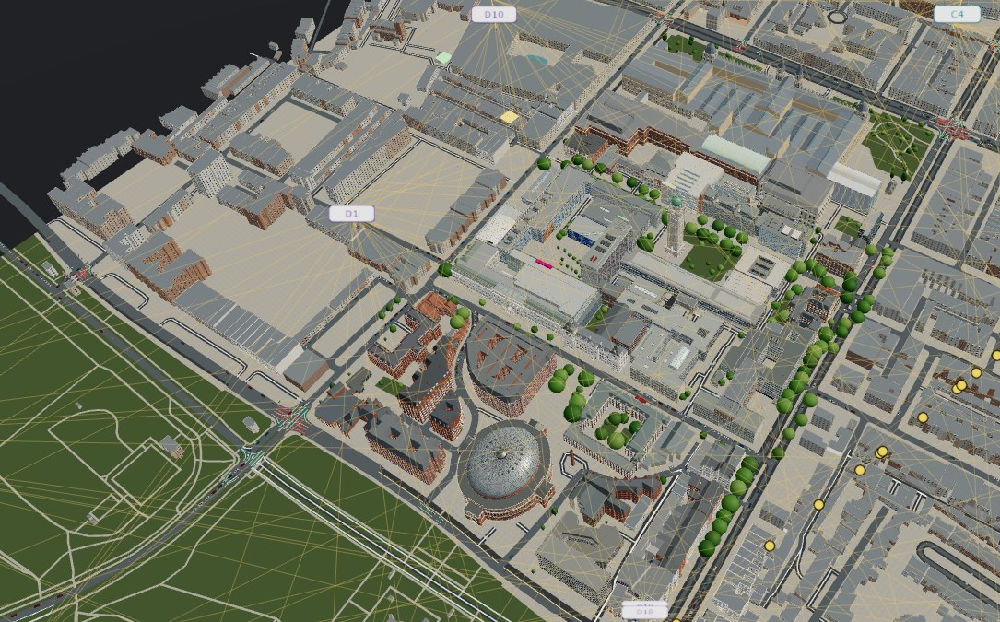
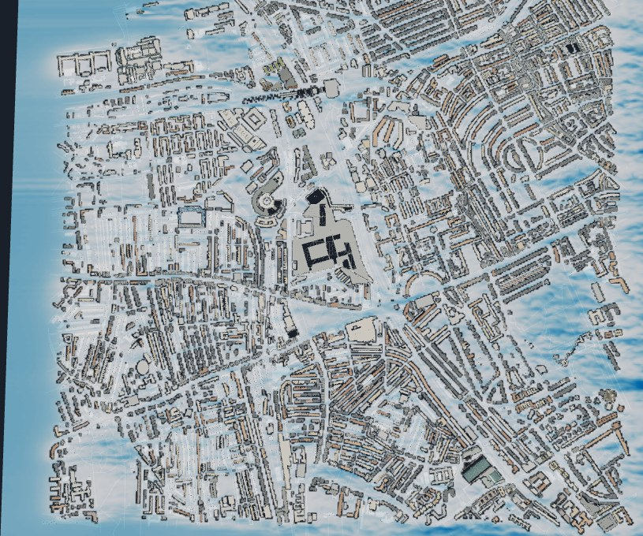

<h1 align="center">Physics-Grounded<br>4D World Model Framework</h1>
<p align="center"><strong>Explicit geometry. Physical simulation. Evolving worlds.</strong><br>A Levistone project.</p>

<p align="center">
  <a href="https://acse-yl222.github.io/physics-grounded-4d-world-model-framework/"></a>
  <a href="https://acse-yl222.github.io/urban-world-model-models/"></a>
  <a href="docs/framework/protocol-v1.md"></a>
  <a href="https://acse-yl222.github.io/physics-grounded-4d-world-model-framework/src/visualization/viewer/?manifest=../../../examples/contract-v1/manifest.json"></a>
</p>

<p align="center">
  Yueyan Li, Zhongkai Yuan, Bohan Ye, Akira Eisenbeiss, Xinyang Miao, Dingyu Xuan,<br>
  Chenxu Li, Hongyu Liu, Yiqi Zhu, Yuhang Dai, Xinran Kai, Chris Pain<br>
  <em>Imperial College London, London, United Kingdom</em>
</p>

A framework for connecting 3D geometry, physical fields and moving agents in a shared, time-dependent world. Bring together scene assets and simulation outputs, preserve their spatial and temporal meaning, and explore them through interactive visualization.

Current applications span urban environments, wind farms and rotor experiments. The same integration protocol is designed to support other settings and scales, including indoor scenes. The fourth dimension is **time**.

<table align="center" width="100%">
  <tr>
    <td width="50%">
      <a href="https://acse-yl222.github.io/physics-grounded-4d-world-model-framework/viewer/3d/?scene=south_kensington"></a><br>
      <strong>South Kensington</strong> · Geometry, UAV routes and urban activity
    </td>
    <td width="50%">
      <a href="https://acse-yl222.github.io/physics-grounded-4d-world-model-framework/viewer/3d/?scene=white_city"></a><br>
      <strong>White City</strong> · Urban geometry and wind fields
    </td>
  </tr>
</table>

<p align="center">
  <strong><a href="https://acse-yl222.github.io/physics-grounded-4d-world-model-framework/">Explore the interactive scenes →</a></strong><br>
  <a href="https://acse-yl222.github.io/physics-grounded-4d-world-model-framework/viewer/3d/?scene=south_kensington">South Kensington</a> ·
  <a href="https://acse-yl222.github.io/physics-grounded-4d-world-model-framework/viewer/3d/?scene=white_city">White City</a> ·
  <a href="https://acse-yl222.github.io/physics-grounded-4d-world-model-framework/viewer/windfarm-movie/">Wind farm</a>
</p>

## How to use

1. **Explore a scene.** Open the [website](https://acse-yl222.github.io/physics-grounded-4d-world-model-framework/) to view the published city and wind-farm demonstrations.
2. **Try the shared contract.** The [synthetic example](https://acse-yl222.github.io/physics-grounded-4d-world-model-framework/src/visualization/viewer/?manifest=../../../examples/contract-v1/manifest.json) demonstrates geometry, fields and trajectories in the unified viewer.
3. **Work locally.** Install the framework to inspect scene configurations, serve available data and run a configured simulation pipeline.
4. **Add your own simulation.** Export results through the [integration protocol](docs/framework/protocol-v1.md) and connect them to visualization widgets.

Published scenes currently use their existing specialized viewers. The unified viewer supports protocol-based layers and local scene views; migration progress and validation scope are tracked in the [implementation status](docs/framework/implementation-status.md).

## Requirements

- **Python 3.11+** for the framework CLI, validation and local server.
- **A modern browser** for interactive visualization.
- **Scene inputs and solver dependencies** for real simulation runs. GPU and Blender environments are configured separately where needed.
- **Node.js** for the JavaScript development checks.

A source checkout includes small protocol examples. Large scene datasets and simulation environments are managed separately.

## Install

```sh
git clone https://github.com/acse-yl222/physics-grounded-4d-world-model-framework.git
cd physics-grounded-4d-world-model-framework
python3 -m venv cache/framework/venv
source cache/framework/venv/bin/activate
python -m pip install -e .
```

Inspect the registered scenes and start the viewer:

```sh
p4d scenes
p4d paths south_ken
p4d serve --port 8769
```

Open [localhost:8769](http://127.0.0.1:8769/). When local scene runs are absent, the homepage links open the published scenes. You can also open the [local synthetic example](http://127.0.0.1:8769/src/visualization/viewer/?manifest=../../../examples/contract-v1/manifest.json) directly.

## Run a simulation

Inspect a scene pipeline first:

```sh
p4d run white_city --dry-run
```

With the scene data and solver environment available, run and retain its outputs:

```sh
p4d run --python /path/to/solver/environment/bin/python white_city --run-id my_trial --retain
```

Intermediate results go to `cache/<scene>/pipeline/<run_id>/`. Retention validates completed outputs, copies them into `project/<scene>/runs/` and refuses to overwrite an existing run. The city pipeline can export a protocol bundle and register it as a scene view.

You can also validate and retain an existing export:

```sh
p4d validate /path/to/trial/manifest.json
p4d retain /path/to/completed/trial
```

## See the results

Open the [local unified viewer](http://127.0.0.1:8769/src/visualization/viewer/) to select available protocol scenes and views. It supports **GLB geometry, NPY fields and frame sequences, JSON metadata, and sparse recorded trajectories**.

Use `p4d serve` to load scene data: its HTTP Range support allows NPY data to be read on demand. Layers retain their declared coordinates, units, masks and time samples; unavailable time ranges appear as missing data. The retained South Kensington traffic replay, for example, covers seconds **1–300**.

## Resources

The [resource catalogue](https://acse-yl222.github.io/urban-world-model-models/) provides selected published geometry and simulation assets. Its companion [repository](https://github.com/acse-yl222/urban-world-model-models) organizes them by scene, type and version:

```text
project/<scene>/<resource-type>/<version>/
```

Each registered resource includes file sizes, SHA-256 hashes and provenance. Some city fields and auxiliary assets remain on the framework's `pages` branch for compatibility. See [resource management](docs/framework/resources.md) for the publication layout and compatibility paths.

## Development

The repository separates reusable implementation, retained scene data and disposable workspaces:

```text
src/
  urban_geometry/       # Geometry processing and 3D agents
  urban_flow/           # Physical models, solvers and flow experiments
  traffic/              # Traffic training, prediction and replay
  visualization/        # Viewers, widgets and data adapters
  common/               # Storage, contracts, pipelines and HTTP serving
project/
  south_ken/            # Scene inputs, configuration and retained results
  white_city/
  windfarm/
  actuator_lab/
cache/                  # Reproducible intermediates and local environments
schemas/                # Run, scene and view contracts
examples/               # Small protocol examples
```

For new scenes, solvers or widgets, follow the [integration protocol](docs/framework/protocol-v1.md). Widgets consume declared data layers; solvers stay in their domain modules. [AGENTS.md](AGENTS.md) and the [simulation integration skill](.agents/skills/urban-simulation-contract/SKILL.md) provide the corresponding agent workflow.

Core checks:

```sh
p4d validate examples/contract-v1/manifest.json
python -m unittest discover -s tests -v
node --test tests/test_viewer.mjs
```

Keep separate backups of unpublished scene data and external originals. The local `.history/` directory contains migration recovery material and must not be treated as disposable cache. The `main` branch holds source and small examples; `pages` hosts the public site and previously published assets.

## About

**A Levistone project.** Developed by the authors listed above, affiliated with **Imperial College London**. Module contributions are recorded in [Contribution.md](Contribution.md).

The framework began as UrbanWorldModel and now targets geometry- and physics-grounded environments across scales. `p4d` is the primary command; `uwm` and `UWM_ROOT` remain available for compatibility. The [original project overview](docs/history/README-before-framework.md) preserves the earlier context.
